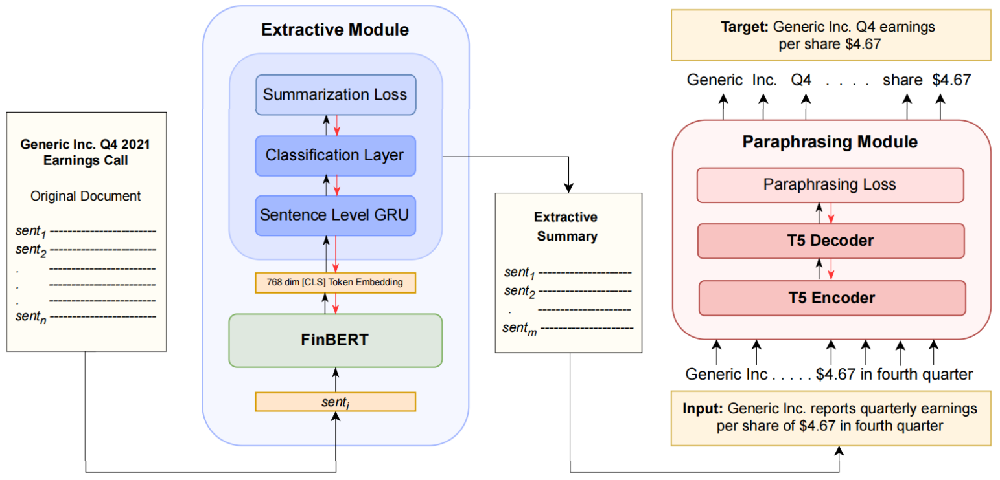

# ECT-BPS: A Bullet Point Summarizer for Earnings Call Transcripts

<!--  -->

<b> ECT-BPS </b> consists of two separately trained modules:
<li> <b> Extractive Module </b>: It is trained to identify the most relevant sentences from the input ECT document.
<li> <b> Paraphrasing Module </b>: It is trained to rephrase the extracted ECT sentences to the format of target (Reuters) sentences, thereby generating a set of bullet points that effectively summarize the source ECT document.

Implementation details can be found in the paper. Instructions to train and test the modules are given in the respective folders.
